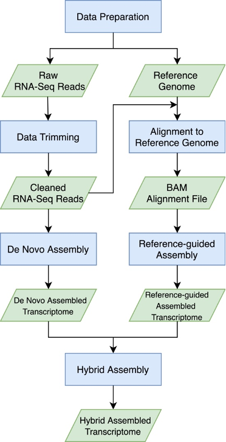

[](http://www.gnu.org/licenses/gpl-3.0)

# Data, Code and Workflows Guideline

## Overview: NGS Transcriptome Assembly

This is a workflow to assemble transcriptome from NGS RNA-Seq data using de novo method, reference guided method and hybrid method. 



## Installation

- __Running environment__: 
    - The workflow was constructed based on the Ubuntu 18.04.6 LTS (GNU/Linux 4.15.0-161-generic x86_64) with 251GB memory and 40 cores


- __Required software and versions__: 
    - [SRAtoolkit v2.11.1](https://trace.ncbi.nlm.nih.gov/Traces/sra/sra.cgi?view=software)
    - [Trimmomatic v0.39](http://www.usadellab.org/cms/?page=trimmomatic)
    - [Trinity v2.12.0](https://github.com/trinityrnaseq/trinityrnaseq/wiki)
    - [BWA 0.7.17-r1188](http://bio-bwa.sourceforge.net/)
    - [Samtools v1.9](http://samtools.sourceforge.net/)
    - [StringTie v2.1.6](https://ccb.jhu.edu/software/stringtie/)
    - [PASA pipeline v2.4.1](https://github.com/PASApipeline/PASApipeline)


## Input Data

The example data used here is the reference genome of cowpea IT97K. paired-end fastq file generated by using Illumina platform.  

- reference genome file: `input/Vunguiculata_540_v1.0.fa`  download from [Phytozome](https://phytozome-next.jgi.doe.gov/)


## Major steps

#### Step 1: running the data preparation step to generate input files
- Note that you have to normalize the path in the shell script.

```
sh workflow/1_data_prep.sh
```

#### Step 2: data trimming for raw RNA-Seq reads

```
sh workflow/2_data_trimming.sh
```

#### Step 3: perform de novo assembly by Trinity

```
sh workflow/3_de_novo_assembly.sh
```

#### Step 4: perform reference guided assembly by StringTie and Trinity independently

```
sh workflow/4_reference_guided_assembly.sh
```

#### Step 5: perform hybrid assembly by PASA

```
sh workflow/5_hybrid_assembly.sh
```

## Expected results


## License
It is a free and open source software, licensed under [MIT](https://github.com/github/choosealicense.com/blob/gh-pages/LICENSE.md).